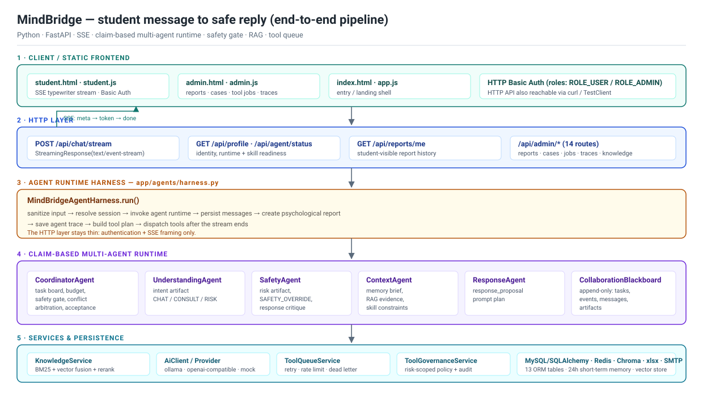
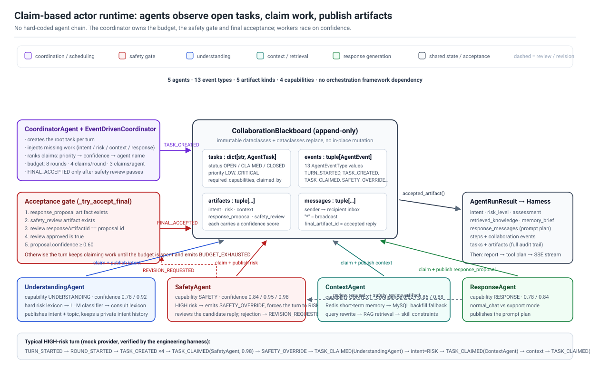

<div align="center">

# MindBridge · 面向高校心理场景的多 Agent 智能体平台

**事件驱动 · 共享黑板 · 任务认领 · 安全优先**

[](https://github.com/approfile/mindbridge-py/actions/workflows/test.yml)


学生端 SSE 流式对话 · 意图路由 · 心理知识检索 · 风险识别与高危预警闭环

</div>

---

## 目录

- [这个项目是什么](#这个项目是什么)
- [端到端链路](#端到端链路)
- [一、事件驱动多 Agent Runtime](#一事件驱动多-agent-runtime)
- [二、Agent Runtime Harness](#二agent-runtime-harness)
- [三、检索增强生成（RAG）](#三检索增强生成rag)
- [四、分层记忆与上下文压缩](#四分层记忆与上下文压缩)
- [五、Skill 体系](#五skill-体系)
- [六、风险识别与安全工程](#六风险识别与安全工程)
- [七、MCP 工具与异步任务队列](#七mcp-工具与异步任务队列)
- [八、数据模型](#八数据模型)
- [九、HTTP API](#九http-api)
- [十、快速开始](#十快速开始)
- [十一、工程 Harness 与测试](#十一工程-harness-与测试)
- [十二、实测数据（可复现）](#十二实测数据可复现)
- [十三、开发过程中发现并修复的缺陷](#十三开发过程中发现并修复的缺陷)
- [十四、当前局限与后续演进](#十四当前局限与后续演进)
- [十五、目录结构](#十五目录结构)

---

## 这个项目是什么

MindBridge 是一个面向高校心理支持场景的后端服务。它要解决的问题是：**学生用自然语言说的一句话，如何变成一条既能被学生接受、又符合校园心理危机干预流程的安全回复，并且整个过程可追溯。**

围绕这个目标，项目在一条请求链路上同时处理四件事：

| 关注点 | 做法 |
| --- | --- |
| **理解** | `CHAT / CONSULT / RISK` 三路意图路由，普通问题不查知识库，心理与风险场景才进入检索增强 |
| **证据** | 校园心理知识库（11 篇内置文档）混合检索：向量召回 + BM25 召回 + 分数融合 + 本地重排 |
| **安全** | 词典硬拦截 → LLM 结构化评估 → 启发式兜底的三级风险判定，`SafetyAgent` 独立审查并可强制否决 |
| **闭环** | 心理报告落库、Excel 台账、风险个案、辅导员预警（异步队列，含重试/限流/死信），全链路 trace |

技术选型的出发点：**编排层不依赖 LangChain / LangGraph**。多 Agent 协作、任务调度、预算控制、安全门槛全部自研，因为这类心理安全场景需要"谁在什么时候有权否决一条回复"是完全可读、可审计的，而不是藏在框架黑盒里。

> 本文档中所有量化数据都来自仓库内的评测集与测试，可用 `python -m app.harness.runner` 与 `python -m unittest discover -s tests` 复现。第 [十三](#十三开发过程中发现并修复的缺陷) 节记录了开发过程中真实定位并修复的缺陷。

---

## 端到端链路



一条学生消息的完整生命周期：

```text
POST /api/chat/stream  (HTTP Basic Auth, 学生角色)
  └─ ChatService.stream_chat                          app/services/chat.py
       ├─ MindBridgeAgentHarness.run                  app/agents/harness.py
       │    ├─ PrivacySanitizer.sanitize(input)       手机号 / 邮箱 / 身份证 → [已脱敏]
       │    ├─ 解析或新建 ChatSession
       │    ├─ EventDrivenAgentRuntimeService.run      ← 多 Agent 协作（见下一节）
       │    ├─ 持久化学生消息（MySQL + Redis 短期记忆）
       │    ├─ intent != CHAT 时写入 PsychologicalReport
       │    └─ AgentTraceService.save_run              完整协作过程落库
       ├─ AiClient.stream(prompt_plan)                SSE 逐 token 推送
       └─ harness.dispatch_tools(tool_plan)           队列或 MCP，不阻塞流式输出
```

关键设计：**HTTP 层只负责认证和 SSE 分帧**。所有业务编排（脱敏、落库、报告、工具计划、trace）集中在 Harness 内，因此换传输协议（HTTP / 命令行 / 批处理）不需要改动 Agent 逻辑。

---

## 一、事件驱动多 Agent Runtime



### 为什么不用固定 workflow

心理危机场景里，**谁应该参与这一轮、什么时候必须停下来，取决于输入本身**。一句"帮我解释一下 Python 字典推导式"不需要检索知识库、不需要记忆摘要；而"我不想活了"必须强制升级为高风险流程、必须查知识库、必须由安全角色审查候选回复。

如果把顺序写死（`intent → risk → context → response`），就会出现两种坏情况：普通聊天被迫付出检索和记忆的延迟成本；或者高风险流程因为某个前置步骤失败而被跳过。所以这里采用 **claim-based actor runtime**：

- `CoordinatorAgent` **不调用**其他 Agent，只维护任务板和预算；
- 专业 Agent **主动观察**黑板上的开放任务，根据能力匹配和置信度**自行认领**；
- 每轮结束由协调者检查是否满足**最终采纳条件**，满足即收敛。

### 共享黑板 `CollaborationBlackboard`

`app/agents/events.py` 用 `@dataclass(frozen=True)` 定义全部协作数据结构，任何"更新"都返回新对象（`dataclasses.replace`），因此黑板天然是 append-only 的：

| 结构 | 作用 |
| --- | --- |
| `tasks: dict[str, AgentTask]` | 任务板。`AgentTask` 含 `priority`、`status`、`required_capabilities`、`claimed_by`、`depends_on` |
| `events: tuple[AgentEvent, ...]` | 全量事件流（13 种 `AgentEventType`），是审计与 trace 的事实来源 |
| `artifacts: tuple[AgentArtifact, ...]` | 各 Agent 发布的产物（`intent` / `risk` / `context` / `response_proposal` / `safety_review`），每个都带 `confidence` |
| `messages: tuple[AgentMessage, ...]` | Agent 间的定向消息（`recipient` 支持 `*` 广播），可查询"发给我的" |
| `final_artifact_id` | 被最终采纳的回复产物 ID |

### 一轮对话的调度循环

`EventDrivenCoordinator.run()`（`app/agents/coordinator.py`）：

```text
for round in 1..agent_max_rounds:            # 默认 8 轮
    ROUND_STARTED
    _derive_missing_work()                   # 缺什么产物就补什么任务
    _try_accept_final()                      # 满足条件 -> FINAL_ACCEPTED, 立即收敛
    candidates = _claim_candidates()          # 按 优先级 → 置信度 → agent 名 降序
    for task, candidate in candidates:        # 每轮最多 agent_max_claims_per_round 个
        TASK_CLAIMED                          # 认领写回黑板, claimed_by 留痕
        result = candidate.agent.act(task, board)
        apply_turn_result(...)                # 事件 / 产物 / 后续任务 / 关闭任务
    _try_accept_final()
BUDGET_EXHAUSTED                              # 预算耗尽仍未收敛则显式标注
```

**预算控制**由三个独立阈值组成，防止单个 Agent 独自刷满预算或死循环：

```text
AGENT_MAX_ROUNDS=8                      # 调度轮数上限
AGENT_MAX_CLAIMS_PER_ROUND=4            # 单轮最多执行几个认领
AGENT_MAX_CLAIMS_PER_AGENT=3            # 单个 Agent 整轮对话最多认领几次
AGENT_FINAL_ACCEPTANCE_MIN_CONFIDENCE=0.6
```

### 五个 Agent 的真实分工

| Agent | 能力 | 认领依据 | 产出 |
| --- | --- | --- | --- |
| `CoordinatorAgent` | `COORDINATION` | 不被认领，由调度循环驱动（`decide()` 恒返回 `False`） | 根任务、预算、采纳决策 `FINAL_ACCEPTED` |
| `UnderstandingAgent` | `UNDERSTANDING` | 存在未完成的 `intent` 产物 | `intent` + `topic`，私有记忆记录历史意图 |
| `SafetyAgent` | `SAFETY` | 存在未评估的风险 / 存在未被审查的候选回复 | `risk`（HIGH 时附带 `SAFETY_OVERRIDE`）、`safety_review` 或 `critique` |
| `ContextAgent` | `CONTEXT` | `intent ∈ {CONSULT, RISK}` 或 `risk ∈ {MEDIUM, HIGH}` | `context`：记忆摘要、模型历史、检索证据、skill 约束 |
| `ResponseAgent` | `RESPONSE` | `intent` 与 `risk` 均已就绪，且上下文齐备或为高风险 | `response_proposal`（回复 prompt 方案，非最终文本） |

每个 Agent 拥有**独立的模型 profile、独立 system prompt、独立 Redis 私有记忆 key、独立工具权限**（`AgentProfile`，见 `app/services/agent_models.py`）。这让"理解用便宜模型、安全用严格模型"成为配置项而非代码改动。

### 最终采纳条件（安全闸门）

`_try_accept_final()` 要求**五个条件同时满足**，任意一条不满足就继续认领任务，直到预算耗尽：

```text
1. 存在 response_proposal 产物
2. 存在 safety_review 产物
3. safety_review.metadata.responseArtifactId == response_proposal.id   ← 审查必须针对当前这一版
4. safety_review.payload.approved is True
5. response_proposal.confidence >= 0.60
```

第 3 条是刻意设计的：**防止"审查了旧版本、却采纳了新版本"**。如果 `SafetyAgent` 否决了候选回复，它会发布 `REVISION_REQUESTED` 和一个 `task:revise-response:*` 任务，由 `ResponseAgent` 重新提出方案。

### `SAFETY_OVERRIDE` 的作用范围

`SafetyAgent` 一旦判定 `risk == HIGH`，会额外发布一个 `SAFETY_OVERRIDE` 事件。该事件在**四个位置**被消费，效果是"本轮全局强制升级"，而不是只影响风险评估：

```text
_select_intent()         → intent 直接变为 RISK
_select_risk()           → risk 直接变为 HIGH
coordinator._risk_value() → context/response 任务priority 提升到 CRITICAL
autonomous._risk_level()  → ResponseAgent 走 support/high-risk 分支
```

---

## 二、Agent Runtime Harness

`MindBridgeAgentHarness`（`app/agents/harness.py`）是**业务编排层**，把"一次 Agent run"包装成应用可用的一次事务。它刻意不介入内部协作方式，只做七件事：

```text
1. 输入脱敏        PrivacySanitizer.sanitize()         原始文本入库，脱敏文本进模型
2. 会话解析        sessionId 命中则复用，否则新建 ChatSession
3. 调用 runtime    create_agent_runtime() → 事件驱动 runtime
4. 消息持久化      MySQL chat_messages + Redis 短期记忆
5. 心理报告        intent != CHAT 时写入 psychological_reports
6. Trace 落库      AgentTraceService.save_run()         事件/任务/产物全量快照
7. 工具计划        AgentToolPlan(report_id, risk_level) → 队列或 MCP
```

**为什么值得单独抽一层**：Agent runtime 只应该关心"如何在黑板上协作产出候选回复"。而"要不要写报告""写不写 Excel 台账""发不发预警""trace 存哪些字段"是**业务与合规问题**，会随学校政策变化。把两者解耦后，runtime 可以独立测试，业务规则也可以独立演进。

Trace 表 `agent_run_traces` 不只有最终答案，而是完整协作快照：`intent`、`risk_level`、`original_input`、`sanitized_input`、`memory_brief`、`agent_steps_json`（含 `agent_event` / `agent_task` / `agent_artifact` 三类条目）、`retrieved_knowledge_json`、`response_messages_json`、`assessment_json`。

---

## 三、检索增强生成（RAG）

### 为什么是"路由式 RAG"而不是"每轮都检索"

普通聊天（"解释一下 Python 字典推导式"）检索校园心理知识库**只会引入噪声并增加延迟**。因此 `ContextAgent` 只在下面条件成立时才检索：

```text
intent ∈ {CONSULT, RISK}  或  risk ∈ {MEDIUM, HIGH}
```

这也被工程 harness 作为断言固化：普通聊天必须 `retrieved_knowledge == 0`，咨询/风险必须 `> 0`。

### 混合检索链路

```text
query
 ├─ 查询改写      ContextAgent._rewrite_query()  用 LLM 改写成适合知识库的中文检索词（截断 60 字）
 ├─ 向量召回      ChromaKnowledgeStore            cosine 空间，score = 1 / (1 + distance)
 ├─ BM25 召回     自研实现，k1=1.5, b=0.75        中英混合分词（英文词 + 汉字单字 + 汉字 bigram）
 ├─ 分数归一化    normalize_scores()             min-max，各自独立归一化
 ├─ 加权融合      (v × 0.65 + b × 0.35) / 1.0    向量为空时向量权重自动归零
 ├─ 本地重排      rerank_score()                 base×0.55 + 词面相似×0.25 + 覆盖率×0.15 + 短语×0.05
 └─ 上下文扩展    _expand_best()                 对 top1 拼接同源相邻 chunk（±1）
```

**设计说明**：重排是**确定性公式**而非交叉编码器模型。这是一个明确的取舍——校园心理知识库规模在几十到几百个 chunk 量级，引入一个 500MB 的 rerank 模型换来的收益不足以抵消部署成本和推理延迟；而公式化重排的**行为完全可预测**，在安全敏感场景里更容易解释和回归。代码里的常量都留有明确的语义（词面相似度、查询覆盖率、短语命中），便于按评测集调参。

### 降级策略（三层防护）

演示环境和生产环境的依赖可用性差异很大，因此检索链路设计了逐层降级，且**降级行为显式暴露**而不静默：

| 层级 | 触发条件 | 行为 |
| --- | --- | --- |
| 构造期 | 缺 `OPENAI_API_KEY` 或 `chromadb` 未安装 | `can_embed=False`，记录可读原因 |
| 构造期 | 上述情况 + `KNOWLEDGE_VECTOR_REQUIRED=true` | 抛 `VectorStoreUnavailable`，**快速失败**（演示/验收要求走向量链路时使用） |
| 检索期 | embedding / Chroma 调用异常 | `KNOWLEDGE_VECTOR_REQUIRED=false` → 记录 warning 并用纯 BM25 兜底；`=true` → 原样抛出 |
| 融合期 | 向量候选为空 | 向量权重自动归零，等价于纯 BM25 + 重排 |

当前使用的检索链路可通过 `GET /api/admin/knowledge/status` 的 `primaryRetrieval` / `fallbackRetrieval` / `vectorAvailable` / `vectorError` 直接查看。

### 评测指标

`app/rag_eval/runner.py` 在 60 条人工构造的评测集上计算五个指标：

- `HitRate@K`：top-K 中是否至少有一条相关
- `Recall@K`：命中即 1.0（二值近似，非分级召回）
- `Precision@K`：相关条数 / K
- `MRR`：1 / 首个相关结果的排名
- `NDCG@K`：二值增益的归一化折损累计增益

相关性判定为 `expectedSources` 命中 **或** `expectedTerms` 命中（词长 ≥ 2）。评测集覆盖风险等级判定、焦虑/低落/孤独/转介、咨询边界三类主题。实际数值见[第十二节](#十二实测数据可复现)。

---

## 四、分层记忆与上下文压缩

长对话会拖慢推理、抬高成本，并且会把早期无关内容带进心理支持语境。这里采用**三层记忆**：

| 层 | 存储 | 内容 | 生命周期 |
| --- | --- | --- | --- |
| 完整历史 | MySQL `chat_messages` | 原文全量 | 永久 |
| 短期窗口 | Redis List `mindbridge:short-term-memory:{sessionId}` | 最近 `REDIS_MEMORY_MAX_MESSAGES=40` 条（写入前脱敏） | TTL `86400s`，每次追加续期 |
| Agent 私有记忆 | Redis `agent:{AgentName}:{sessionId}` | 各 Agent 自己的中间结论（意图历史、风险台账、审查结论） | 同上 |

**回填机制**：Redis 未命中时 `ContextAgent._load_history()` 会从 MySQL 按 `created_at desc` 取回窗口并 `replace()` 回填 Redis。因此 Redis 重启或者整段未使用都不会丢历史，只是会多一次数据库读。

**压缩策略**（`compact_history_for_prompt`）：

```text
history 长度 ≤ MEMORY_COMPACTION_RECENT_MESSAGES(8)  →  原样使用
否则  →  [ 系统摘要消息, *最近 8 条 ]
摘要 = 学生近期关注(user 末 4 条, 各 80 字)
     + 已给过的支持(assistant 末 3 条, 各 70 字)
     + 本轮输入关注(80 字)                 总长 ≤ MEMORY_SUMMARY_MAX_CHARS(500)
```

摘要消息带有明确的作用域声明——"仅供内部上下文使用；不要向学生展示；不要据此输出诊断、风险等级或后台标签"。这一点很重要：**压缩后的摘要本身可能含有风险信息，必须防止它被模型回显给学生**。

此外 `ContextAgent._bounded_model_history()` 会把进入模型的窗口限制在 `chat_history_limit × 2 = 20` 条，且保留首条 system 消息。

---

## 五、Skill 体系

`skills/*/SKILL.md` 以 YAML front-matter + Markdown 正文描述一类专业处置规范，由 `MindBridgeSkillRegistry` 在运行时加载：

```markdown
---
name: high_risk_safety_plan
description: 高风险场景下优先完成短期安全计划的回复规范
---
## Workflow
...
```

| Skill | 触发场景 |
| --- | --- |
| `supportive_response_baseline` | 所有心理咨询/风险回复的基础共情与边界规则 |
| `high_risk_safety_plan` | 高风险：优先完成短期安全计划 |
| `anxiety_grounding_support` | 焦虑、惊恐、崩溃的稳定化与 grounding |
| `sleep_routine_support` | 失眠、睡眠节律紊乱 |
| `academic_stress_planning` | 考试、作业、论文、绩点压力 |
| `referral_resource_guidance` | 校内心理中心、辅导员、紧急资源转介 |
| `counselor_handoff_summary` | 生成给辅导员看的个案交接摘要（含 ` ```text ` 模板） |

**加载即校验**：`validation_issues()` 会检查目录名与 `name` 是否一致、是否包含 `## Workflow`、`description` 是否过短、`counselor_handoff_summary` 是否提供模板。`GET /api/agent/status` 与 `/api/admin/knowledge/status` 直接暴露每个 skill 的 `READY / WARN / FAILED` 与问题列表，因此**新增/修改 skill 后能立刻发现格式退化**。

**注入方式**：选中的 skill 正文以 `应用 skill: {name}\n{body}` 拼接，作为 `ResponseAgent` 回复用 system prompt 的"可用 skill 指引"段落。高风险时选择集合被固定为 `[supportive_response_baseline, high_risk_safety_plan]`——**高风险不走关键词匹配，避免漏选**。

---

## 六、风险识别与安全工程

### 三级风险判定

```text
第一级  硬规则词典      HIGH_RISK_WORDS 命中 → 立即 HIGH (confidence 0.95)
                                             不调用模型（有测试固化这一行为）
第二级  LLM 结构化     严格 JSON: {emotion, emotionScore, risk, confidence, summary}
                       并进行分数-等级一致性校正：emotionScore ≥ 4 → HIGH，≥ 3 → MEDIUM
第三级  启发式兜底     模型异常时用词面信号给出保守结论，绝不放行
```

**为什么第一级必须存在**：模型可能超时、限流、返回非法 JSON。在危机场景里，**"模型不可用"不能等于"没有风险"**。词典硬拦截保证了即使整个模型链路挂掉，明确的高风险表达依然会被判定为 HIGH 并触发后续流程。反过来，词典判定也会被分数一致性校正覆盖（`emotion == HIGH_RISK` 强制 `risk = HIGH`）。

### 安全审查与可审计性

`SafetyAgent._review_response()` 审查候选回复，高风险场景下要求回复正文包含即时安全指引要素（当前安全、可信任的人、紧急资源等），否则发布 `critique` + `REVISION_REQUESTED`，由 `ResponseAgent` 重写。审计方式是把"审查意见"本身作为带 `responseArtifactId` 的产物入黑板，因此**每一次否决都留下原因和对应版本**。

### 不向学生暴露后台结论

学生可见的回复绝不含风险等级、心理标签、情绪分数、报告 ID。这条规则由三层保障：

1. `PromptTemplates.answer_system_prompt()` 在 CHAT 分支明确禁止主动测评与输出标签；
2. 压缩摘要消息自带"不要向学生展示"的作用域声明；
3. **工程 harness 对真实 SSE 输出做禁用词断言**：`["风险等级", "报告ID", "emotionScore", "HIGH_RISK"]`。

### 输入脱敏

`PrivacySanitizer` 在三个位置生效：进入模型前（`model_input`）、写入 Redis 前、从 Redis 读出后。覆盖手机号、邮箱、身份证号，替换为 `[已脱敏]`。

> 需要诚实说明的边界：这是**最小可用**的脱敏实现，不覆盖姓名、学号、住址、银行卡、微信号等；且 MySQL 中保存的是原文（出于合规审计需要）。第 [十四节](#十四当前局限与后续演进) 给出了演进方向。

---

## 七、MCP 工具与异步任务队列

高风险触发后需要做三件事：写 Excel 台账、建风险个案、通知辅导员。这些都**不能在 SSE 流式响应路径上同步执行**——一次 SMTP 超时就足以卡住学生端。

### 为什么两种执行模式并存

| 模式 | 开关 | 适用 |
| --- | --- | --- |
| 异步队列（默认） | `TOOL_QUEUE_ENABLED=true` | 生产：与请求解耦，具备重试/限流/死信能力 |
| MCP stdio 直连 | `TOOL_QUEUE_ENABLED=false` | 演示/调试：可观察单次工具调用的完整报文 |

两条路径**复用同一套工具实现**（`ToolOrchestrationService`），因此不存在"演示能跑、生产行为不同"的问题。

### 任务链与依赖

```text
PsychologicalReport (risk=HIGH)
  ├─ EXCEL_REPORT   写台账（进程内锁串行化，按 report_id 幂等）
  └─ CASE_CREATE    建个案（按 report_id 幂等，生成辅导员交接摘要）
       └─ ALERT_SEND  依赖 CASE_CREATE 成功后才执行（depends_on_job_id）
```

依赖门闸 `_dependency_ready()` 在**执行时**校验，未就绪则重新入队等待；因此"个案没建成就发了预警"这种状态不一致不会发生。

### 重试、限流与死信

```text
尝试次数      TOOL_QUEUE_MAX_ATTEMPTS=3
线性退避      TOOL_QUEUE_RETRY_DELAY_SECONDS(15s) × attempts  →  15s / 30s / 45s
超过上限      status → DEAD，写入 dead_letter_records（保留 kind/reason/payload）
邮件限流      RateLimiter：60 秒滑动窗口，默认 30 次/分钟，超限返回 retry_after 重新入队
重启恢复      启动时把遗留 RUNNING 任务复位为 PENDING
```

### 工具策略与审计

`ToolPolicyRegistry` 为每个工具定义**允许的风险等级范围**，队列 worker 在执行前强制校验：

| 工具 | 允许的风险等级 |
| --- | --- |
| `EXCEL_REPORT` | LOW / MEDIUM / HIGH |
| `CASE_CREATE` | MEDIUM / HIGH |
| `ALERT_SEND` | HIGH |
| `RISK_ALERT`（兼容保留） | HIGH |

每次执行都会写入 `tool_audit_records`（`allowed`、`policy`、`status`、`reason`、`payload`），可通过 `GET /api/admin/tool-audits` 查询。这是"低风险消息不应该触发辅导员预警"这条策略的执行点。

### MCP 服务暴露的工具

`app/mcp_tools/server.py` 基于 FastMCP，以 stdio 方式暴露 6 个工具：

```text
mindbridge_excel_report(report_id)              写 Excel 台账
mindbridge_case_create(report_id)               创建/复用风险个案
mindbridge_alert_send(case_id)                  发送或记录预警
mindbridge_alert_ack(case_id, actor, note)      辅导员确认接手
mindbridge_case_note_add(case_id, actor, note)  追加个案备注
mindbridge_alert_notify(report_id)              预警通知
```

预警投递支持 `log`（记录不发送，演示默认）与 `smtp` 两种模式；SMTP 未配置时不会中断聊天，而是写入 `alert_records` 并列出缺失的配置项。

---

## 八、数据模型

`app/models/entities.py` 共 13 张表，按职责分为四组：

```text
身份与会话      user_accounts · chat_sessions · chat_messages
知识与检索      knowledge_chunks (含 embedding_json 缓存)
风险与处置      psychological_reports · risk_cases · case_notes
                alert_records · excel_records
任务与可观测    tool_jobs · dead_letter_records · tool_audit_records · agent_run_traces
```

几个值得说明的设计：

- `chat_sessions.public_id` 用 UUID 对外暴露，**自增主键不离开服务端**；
- `knowledge_chunks.embedding_json` 缓存已算出的向量，避免重复调用 embedding 接口（`_embeddings_for_chunks()` 只对缺失项发起请求）；
- `risk_cases.report_id` 唯一索引保证个案幂等；
- `tool_jobs.run_after` + `status` 建索引，支撑轮询式派发；
- `agent_run_traces` 的 JSON 字段保留完整协作过程，便于事后复盘一次不安全回复的决策路径。

---

## 九、HTTP API

认证为 **HTTP Basic Auth**（`ROLE_USER` / `ROLE_ADMIN`），管理员账号不允许发起学生对话（返回 403）。

| 方法 | 路径 | 权限 | 用途 |
| --- | --- | --- | --- |
| GET | `/actuator/health` | 公开 | 健康检查 |
| GET | `/api/profile` | 登录 | 当前身份与角色 |
| POST | `/api/chat/stream` | 学生 | SSE 流式对话（`meta` → `token`* → `done`） |
| GET | `/api/agent/status` | 登录 | 模型 provider、runtime 框架、Agent 协作配置、Skill 就绪状态 |
| GET | `/api/reports/me` | 登录 | 自己的报告历史 |
| GET | `/api/admin/reports` | 管理员 | 全部报告 |
| GET | `/api/admin/cases` | 管理员 | 风险个案 |
| GET | `/api/admin/cases/{id}/notes` | 管理员 | 个案备注 |
| GET | `/api/admin/excel-records` | 管理员 | Excel 台账记录 |
| GET | `/api/admin/alerts` | 管理员 | 预警记录 |
| GET | `/api/admin/tool-jobs` | 管理员 | 工具任务 |
| GET | `/api/admin/dead-letters` | 管理员 | 死信 |
| GET | `/api/admin/tool-audits` | 管理员 | 工具策略审计 |
| GET | `/api/admin/agent-traces` | 管理员 | Agent 协作 trace |
| GET | `/api/admin/conversations/{sessionId}` | 管理员 | 会话全文 |
| POST | `/api/admin/knowledge` | 管理员 | 文本入库 |
| POST | `/api/admin/knowledge/file` | 管理员 | 上传 md / txt / pdf 入库 |
| GET | `/api/admin/knowledge/status` | 管理员 | 检索链路与向量库状态 |
| POST | `/api/admin/knowledge/rebuild-vector` | 管理员 | 全量重建向量索引 |
| POST | `/api/admin/knowledge/backup` | 管理员 | 生成 Chroma 快照 |

前端为原生 HTML/CSS/JS（`app/static/`），学生端为 SSE 打字机效果，管理端提供报告/个案/任务/trace 视图。

---

## 十、快速开始

### 最省事的方式：不需要任何外部服务

`AI_PROVIDER=mock` 是一个**确定性桩模型**，配合 SQLite 可以在零依赖的情况下跑通完整链路（意图路由、多 Agent 协作、风险判定、SSE 流式输出、工具入队）。

```bash
python -m venv .venv && source .venv/bin/activate   # Windows: .venv\Scripts\activate
pip install -r requirements.txt

# 环境变量（也可以写进 .env）
export AI_PROVIDER=mock
export DATABASE_URL=sqlite:///./data/mindbridge.db
export KNOWLEDGE_VECTOR_ENABLED=false     # 无 API Key 时用纯 BM25 检索
export TOOL_QUEUE_ENABLED=false           # 简化本地运行

uvicorn app.main:app --host 127.0.0.1 --port 8080
```

打开 <http://127.0.0.1:8080>，学生账号 `student / student123`，管理账号 `admin / admin123`。

想先看看多 Agent 到底怎么协作，不需要起服务：

```bash
python scripts/demo_turn.py
```

它会用同一个 mock 模型跑三个代表性场景（普通聊天 / 心理倾诉 / 高风险），并打印每个场景的**完整协作事件流**（谁在什么时候认领了哪个任务、发布了什么产物、最终采纳了哪一版回复）。

### 接真实模型

```bash
# 本地 Ollama（需自行准备 GGUF 权重，见 models/mindbridge-qwen2.5-7b-ft/）
AI_PROVIDER=ollama OLLAMA_MODEL=mindbridge-qwen2.5-7b-ft:latest ./scripts/run-dev.sh

# 任意 OpenAI 兼容端点
AI_PROVIDER=openai \
OPENAI_BASE_URL=https://api.openai.com/v1 \
OPENAI_API_KEY=sk-... \
OPENAI_MODEL=gpt-4o-mini \
uvicorn app.main:app --port 8080
```

### Docker Compose（MySQL + Redis + App）

```bash
cp .env.example .env      # 填入需要的外部 Key
docker compose up -d --build
```

### 调用示例

```bash
# 普通聊天：不触发检索和报告
curl -N -u student:student123 -H 'Content-Type: application/json' \
  -d '{"message":"帮我解释一下 Python 字典推导式"}' \
  http://127.0.0.1:8080/api/chat/stream

# 咨询：触发检索，写入报告，但不会通知辅导员
curl -N -u student:student123 -H 'Content-Type: application/json' \
  -d '{"message":"我最近压力很大，连续几天失眠"}' \
  http://127.0.0.1:8080/api/chat/stream

# 高风险：触发检索 + 报告 + Excel 台账 + 个案 + 预警
curl -N -u student:student123 -H 'Content-Type: application/json' \
  -d '{"message":"我不想活了，感觉撑不下去了"}' \
  http://127.0.0.1:8080/api/chat/stream

# 查看一次协作的完整决策路径
curl -u admin:admin123 http://127.0.0.1:8080/api/admin/agent-traces
```

---

## 十一、工程 Harness 与测试

项目提供**一键工程 harness**，用 mock 模型、临时 SQLite、内存版短期记忆验证六条核心链路：

```bash
python -m app.harness.runner                      # 全部
python -m app.harness.runner --suite rag          # 单条：risk|routing|skills|rag|api|tool-queue
python -m app.harness.runner --json
```

| Suite | 验证内容 |
| --- | --- |
| Risk Safety | 中/英高风险、咨询、普通聊天四类输入的报告生成、风险等级、任务入队，**并断言学生可见输出不含后台元数据** |
| Agent Routing | 三档意图与风险，以及各档**必须/不得**出现的 Agent（普通聊天不得出现 `ContextAgent`） |
| Standard Skills | 7 个 skill 全部 `READY`、选择逻辑、交接摘要模板渲染 |
| RAG | 60 条评测集全部指标 + 阈值断言（`hitRate ≥ 0.95`、`mrr ≥ 0.75`、`ndcg ≥ 0.75`） |
| API | 健康检查、认证与越权（学生读管理接口 403、管理员发起对话 403）、SSE 事件、知识库入库 |
| Tool Queue | 三个任务的依赖关系、Excel/个案幂等、限流、死信转移 |

产物：`target/harness/harness-report.json`、`target/harness/rag-eval-report.json`。

单元测试（标准库 `unittest`，无 pytest 依赖，CI 与 harness 都会跑）：

```bash
python -m unittest discover -s tests
```

---

## 十二、实测数据（可复现）

以下数据全部来自仓库内代码与数据文件，可用上述命令复现。

### 工程规模

| 指标 | 数值 |
| --- | --- |
| 后端 Python 文件 | 47 |
| 内置知识库文档 | 11 篇（校园心理总则、风险等级策略、焦虑恐慌、情绪低落、睡眠、学业压力、考试季、人际关系、新生适应、咨询转介、隐私边界） |
| 知识库切块（512 / 64） | 34 个 chunk |
| 标准 Skills | 7 个 |
| 多 Agent 角色 | 5 个（1 协调 + 4 专业） |
| 协作事件类型 | 13 种 |
| 产物类型 | 5 种（intent / risk / context / response_proposal / safety_review） |
| ORM 数据表 | 13 张 |
| HTTP 路由 | 20 条 |
| MCP 工具 | 6 个 |
| RAG 评测集 | 60 条 |
| 工程 Harness Suite | 6 组 |

### RAG 评测（60 条评测集，top-K = 4）

指标定义见[第三节](#三检索增强生成rag)。下表中的数值**实测于向量链路关闭的环境**（无 embedding API Key），即文档描述的降级路径：自研 BM25 + 本地 `hybrid_score` 重排。开启 Chroma 向量召回后，向量候选会以 0.65 的权重参与融合，指标预期不低于该基线。

| 指标 | 实测值 |
| --- | --- |
| 评测集规模 | 60 条 |
| 知识库切块 | 34 个 chunk |
| `HitRate@4` | **0.9667**（58 / 60） |
| `Recall@4` | **0.9667** |
| `Precision@4` | **0.6458** |
| `MRR` | **0.9083** |
| `NDCG@4` | **0.9053** |
| 首个相关结果平均排名 | **1.1552** |

未命中的 2 条：`support-anxiety-overwhelmed`、`support-risk-signals-human-help`。这两条都是"多要素组合"问句（同时要求 grounding、呼吸、规律作息等多个词面线索），纯 BM25 路径下被其他高词面重叠的 chunk 挤出了 top-4，属于词面检索的典型失败模式，也是引入向量召回的动机之一。

harness 的 RAG suite 会对这些指标断言阈值（`hitRate ≥ 0.95`、`recallAtK ≥ 0.95`、`MRR ≥ 0.75`、`NDCG ≥ 0.75`），因此指标回退会被 CI 拦住。

### 全量 Harness 结果

`python -m app.harness.runner` 在 mock 模型 + 临时 SQLite 环境下运行 6 组 suite（Risk Safety / Agent Routing / Standard Skills / RAG / API / Tool Queue），任一组失败进程返回非 0。产物写入 `target/harness/harness-report.json` 与 `target/harness/rag-eval-report.json`；CI 中的 `python -m unittest discover -s tests` 覆盖单元测试与路由回归测试。

上表中的 RAG 指标另行由 `python scripts/verify_offline.py` 实测产出——该脚本在**缺少 FastAPI / Redis / Chroma 依赖的环境**下用最小桩模块跑通真实代码路径（黑板的 claim 写回、工具策略门闸与审计落库、`ReportService` 管理方法、以及 60 条评测集的完整检索评测），因此可以在这类受限环境中复现。完整 harness 与单元测试需要先 `pip install -r requirements.txt`。

<details>
<summary><code>scripts/verify_offline.py</code> 实测输出（33 项断言全部通过）</summary>

```text
1) ReportService admin methods are real class attributes         4 passed
2) EventDrivenCoordinator writes the claim back to the blackboard 8 passed
3) ToolPolicyRegistry risk scoping and audit writes              10 passed
4) AgentTask.claim() merge semantics                              4 passed
5) RAG evaluation (BM25 + local reranker degradation path)        7 passed
   knowledge chunks 34 · cases 60 · hitRate 0.9667 · MRR 0.9083 · NDCG 0.9053
```

</details>

---

## 十三、开发过程中发现并修复的缺陷

代码审计与测试补全过程中定位到以下真实缺陷，均已在当前代码中修复并补上回归测试。之所以记录在这里，是因为它们说明了"**没有测试覆盖的功能等于不存在**"：

### 1. 三个管理接口必然返回 500（已修复）

`app/services/report.py` 中 `agent_run_traces()`、`tool_audits()`、`conversation()` 三个方法因缩进错误被定义在**模块级**而非 `ReportService` 类内。因此：

```text
GET /api/admin/agent-traces          → AttributeError → 500
GET /api/admin/tool-audits           → AttributeError → 500
GET /api/admin/conversations/{id}    → AttributeError → 500
```

而管理端前端 `app/static/admin.js` 正是在调用其中一个接口，也就是说**后台"查看会话"功能完全不可用**。之所以长期没被发现，是因为 `run_api_harness` 恰好没有覆盖这三条路由，而普通单测也不经过它们——**CI 全绿，功能全坏**。

修复：将三个方法移入 `ReportService`，新增 `tests/test_admin_api_routes.py` 通过 `TestClient` 真实请求这三条路由，并覆盖 403 越权与 404 分支。

### 2. 任务认领记录从未落盘（已修复）

`EventDrivenCoordinator.run()` 中调用了 `current_task.claim(agent_name)`，但**认领后的任务没有写回黑板**，随后 `apply_turn_result()` 用的是未认领的实例。后果是：

- `AgentTask.status` 永远不会出现 `CLAIMED`；
- `AgentTask.claimed_by` 恒为空元组；
- `agent_run_traces` 里的 `claimedBy` 字段恒为 `[]`，**"谁认领了这个任务"的审计语义名存实亡**。

修复：认领结果写回黑板，并把 `claimedBy` 记入 `TASK_CLAIMED` 事件 metadata；新增回归测试断言 `claimed_by` 与事件 metadata 一致。

### 3. 工具策略与审计未接线（已修复）

`ToolPolicyRegistry` / `ToolGovernanceService` 已完整实现（按风险等级授权、写审计记录），但**从未被调用**，因此 `tool_audit_records` 表永远是空的，`GET /api/admin/tool-audits` 永远没有数据，"低风险不应触发预警"这条策略实际上没有执行点。

修复：`ToolQueueWorker._run_job()` 在执行前调用 `require_allowed()` 做策略门闸、`start_job()` 记录审计，成功/失败分别 `finish()`；新增 `tests/test_tool_governance_audit.py` 验证策略拦截与审计写入。

### 4. 其他修复

| 问题 | 修复 |
| --- | --- |
| `config.py` 中 `openai_embedding_base_url` / `openai_embedding_api_key` 被重复定义两次 | 删除重复定义（后者覆盖前者会让"第二个变量名"静默失效） |
| Dockerfile 未复制 `skills/`，容器内 skill 列表为空 | 补 `COPY skills ./skills` |
| docker-compose 用 `mysql:8.0` 但文档写 8.4 | 统一为 `mysql:8.4` |
| docker-compose 未透传 SMTP 变量，生产无法从 compose 注入发信配置 | 补全 SMTP / 收件人透传 |
| `.env.example` 中 `AGENT_FRAMEWORK=langgraph` 误导（该值只被识别为 fallback） | 改为实际支持的值并说明 |

### 5. 交付前的安全清理

仓库原始副本的 `.env` 中包含**真实可用的第三方 API Key**。当前 `.gitignore` 已显式排除 `.env`（并允许 `.env.example`），仓库内不含任何密钥。**如果你复用了原始副本，请立即在对应平台作废并重新签发这两个 Key。**

---

## 十四、当前局限与后续演进

这一节写的是真实边界，而不是"未来展望"式的套话。这个项目的定位是**可运行、可审计、可复现的心理场景多 Agent 后端**，距离生产级部署仍有明确差距：

**并发与事务**

- 调度循环是单进程顺序执行（"actor-style" 体现在**控制流语义**而非并发执行）；黑板用不可变结构重建，无锁，单进程安全但多 worker 下 `seed_data`、工具队列的 RUNNING 抢占都缺少分布式协调；
- 每条消息独立 `commit()`，没有跨步骤事务边界；`_dispatch_once()` 中"置 RUNNING"与"提交线程池"之间存在崩溃窗口（靠启动时复位兜底，但没有 lease / visibility timeout）。

**认证与授权**

- HTTP Basic Auth + SHA-256 无盐口令哈希，无 MFA、无令牌过期、无登录限流；生产应替换为 OIDC / JWT 并加口令哈希（bcrypt/argon2）；
- 管理员 trace 接口可读到 `original_input` 原文，需要按最小权限原则收紧或做二次审计。

**安全策略的深度**

- 安全审查是基于要素检查的规则审查，不是分类模型；建议增加独立的回复安全分类器与"危险细节"检测；
- 风险词典为子串匹配，**无否定检测**（"我不想自杀"会被判 HIGH）。误报方向是安全的（宁可多干预），但会带来不必要的干预；改进方向是引入否定作用域识别；
- `PrivacySanitizer` 覆盖手机号/邮箱/身份证，未覆盖姓名、学号、住址、银行卡、微信号。

**检索质量**

- 重排是确定性公式而非学习型模型；
- 评测集只覆盖 2 个知识库文档，无法反映全部 11 篇的检索质量；且 `Recall@K` 是二值近似；
- BM25 每次检索全表载入内存，chunk 规模上量后需要倒排索引与缓存。

**工程完备性**

- 无 Alembic 迁移（依赖 `create_all`）；无结构化日志 / 请求 ID / Prometheus 指标；
- LLM 调用无重试与熔断；`ChatService` 中工具分派异常只记 warning，调用方不可见；
- 无覆盖率门禁、无 lint / type check 配置。

**产品化**

- 前端为原生实现，未做无障碍与移动端适配；
- `models/mindbridge-qwen2.5-7b-ft/` 只提供 Ollama `Modelfile` 与放置说明，**不含 GGUF 权重**（体积原因），需自行微调或下载。

**优先级建议**：真实鉴权 → 事务边界与队列 lease → 否定检测与安全分类器 → 评测集扩容 → 迁移工具与可观测性。

---

## 十五、目录结构

```text
app/
├── agents/            # 多 Agent runtime：黑板、事件、注册表、协调者、Harness
│   ├── events.py            CollaborationBlackboard / AgentTask / AgentEvent / AgentArtifact
│   ├── registry.py          能力注册与候选排序
│   ├── autonomous.py        5 个 Agent 的真实实现
│   ├── coordinator.py       claim-based 调度、预算、最终采纳闸门
│   ├── event_driven_runtime.py  对外入口，产出 AgentRunResult
│   ├── harness.py           MindBridgeAgentHarness 业务编排
│   └── result.py            AgentRunResult / AgentStep
├── api/routes.py      # 20 条 HTTP 路由
├── core/              # 配置、数据库、启动播种、鉴权、枚举
├── knowledge/         # 11 篇内置校园心理知识库
├── mcp_tools/server.py# FastMCP 工具服务（6 个工具）
├── models/entities.py # 13 张 ORM 表
├── rag_eval/          # RAG 评测脚本 + 60 条评测集
├── schemas/           # Pydantic DTO
├── services/          # AI、检索、向量库、记忆、评估、报告、Skill、工具队列、治理、trace
└── static/            # 原生前端（学生端 + 管理端）

docs/                  # 架构图（SVG）+ 面试准备笔记
skills/                # 7 个标准 SKILL.md
tests/                 # 单元测试 + 路由回归测试
scripts/               # 本地运行、Ollama、微调模型、打包、离线验证、演示脚本
models/                # Ollama Modelfile 与权重放置说明
```

补充说明几个脚本：

| 脚本 | 用途 |
| --- | --- |
| `scripts/demo_turn.py` | 零外部依赖跑通三个代表性场景，打印完整协作事件流 |
| `scripts/verify_offline.py` | 在缺少 FastAPI / Redis / Chroma 的环境下用最小桩模块验证核心路径与 RAG 指标 |
| `scripts/run-dev.sh` | 本地启动服务 |
| `scripts/start-ollama.sh` / `create-finetuned-model.sh` | 加载本地微调 GGUF 模型 |
| `scripts/package-release.sh` | 打包交付物（自动排除 `.env`） |

---

<div align="center">

**MindBridge** — 把"一句话"变成"一条负责任的回复"，并让每一步都可追溯。

</div>
